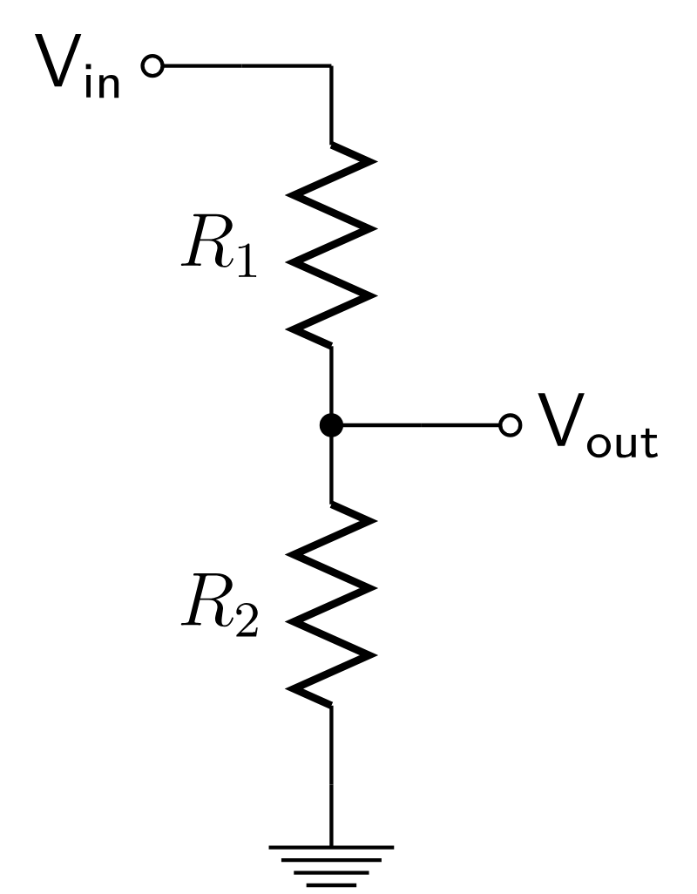

<h1 align="center">
Lab: Lógica de Programación (RA 1, RA 3 y RA 4)  
 </h1>
 

Alexander López-Parrado, PhD.  
Programación, II-2026  
GDSPROC  
Uniquindío  

Esta práctica de laboratorio busca retomar aquellos conocimientos y habilidades adquiridos en el espacio académico Lógica de Programación. Para tal fin, se pondrá en práctica aspectos relacionados con la lógica para la creación de programas de computadora y su implementación en el lenguaje de programación Python.

En ese sentido, la práctica de laboratorio contempla el repaso de estructuras de programación tales como: declaración de variables, sentencias condicionales, sentencias para ciclos, arreglos y funciones. Todo lo anterior en el contexto del laboratorio remoto virtual propuesto para el proyecto final, en particular para esta práctica de laboratorio se considerará un divisor de tensión resistivo como el mostrado en la figura [[1]](#1).

Para empezar, se requiere un fragmento de código en Python que permita calcular la corriente que circula a través del divisor de tensión resistivo.  Para esto, solicite a una herramienta de IA (Inteligencia Artificial) generativa (ChatGPT, DeepSeek, Gemini, Claude) que genere el código de una función que realice esta tarea. Analice el código generado y verifique que la función realiza la tarea correctamente para diferentes valores de voltaje de entrada ($V_{in}$) y de resistencias ($R_1$ y $R_2$).

## Sentencias Condicionales

En esta sección repasará y pondrá en práctica de nuevo las sentencias condicionales del lenguaje de programación Python. 

1. Codifique un programa que solicite $V_{in}$ , y los valores de $R_1$ y $R_2$ junto con su valor máximo de potencia (1/4W, 1/2W o 1W). A continuación, el programa deberá informar al usuario para cada resistencia si esta opera dentro del rango permitido de potencia. 
2. Ejecute el programa y verifique que funciona correctamente.
3. Ahora use la herramienta IA para generar el código del punto 1, verifique el correcto funcionamiento del programa generado y compare con la implementación realizada por usted.

## Ciclos y Arreglos

En esta sección se considerarán las sentencias para ciclos y el uso de arreglos en el lenguaje de programación Python. Para esto, considere el programa de la sección anterior, donde el voltaje de entrada ($V_{in}$) y la corriente ($I$) son fijos e iguales a 5v y 100uA respectivamente.

1.	Cree un nuevo programa que solicite al usuario el número de voltajtes de salida ($V_{out}$). Posteriormente, solicite cada valor de $V_{out}$ y obtenga los valores requeridos para  $R_1$ y $R_2$, asegúrese que el usuario ingrese valores válidos de voltaje ($0<V_{out}<5v$). Los valores de resistencia calculados deben ser almacenados en una lista. 
2.	Modifique el programa del punto anterior para que se calcule e imprima los valores máximo y mínimo de $R_1$ y $R_2$.
3.	Ahora use la herramienta IA para generar el código del punto anterior, verifique el correcto funcionamiento del programa generado y compare con la implementación realizada por usted.

## Funciones

Para terminar, en esta sección pondrá en práctica la creación de funciones en el lenguaje de programación Python. Recuerde que las funciones son construcciones que permiten crear código modular, escalable y de mayor legibilidad.

1. Cree una función que reciba como argumentos $V_{in}$, $I$ y $V_out$.  La función debe realizar lanzamientos consecutivos hasta obtener una combinación en los dados correspondiente al número del argumento, posteriormente la función debe retornar la cantidad de lanzamientos que requirió para obenter el valor solicitado.

## PySpice

Consultar cómo se puede crear una lista de conexiones (_netlist_) en SPICE para el divisor de voltaje  [[2]](#2). 

## Entrega del laboratorio

El laboratorio debe ser presentado mediante:

1. Repositorio en GitHub.
2. Informe de laboratorio.

El informe de laboratorio y el enlace al repositorio de GitHub deben ser compartidos en el enlace dispuesto para tal fin en la plataforma Google Classroom.

## Referencias

<a id="1">[1]</a> 
Wikipedia la enciclopedia libre, "Voltage Divider",url=https://en.wikipedia.org/wiki/Voltage_divider.

<a id="2">[2]</a> 
Wikipedia la enciclopedia libre, "Voltage Divider",url=https://en.wikipedia.org/wiki/SPICE.

